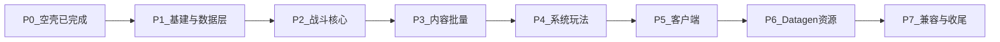
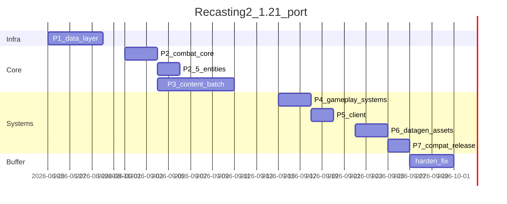

# Recasting2 1.20→1.21 NeoForge 移植计划与时刻表

在已完成的 NeoForge 1.21.1 空壳基础上，按「数据层 → 战斗核心 → 内容批量 → 客户端/Datagen → 兼容」顺序，将 Recasting2 从 Forge 1.20.1 完整移植到 NeoForge 1.21.1；按每日约 4–6 小时有效投入估算约 5 周达到玩法对等可进游戏验收。

## 前提与约束

- **源**：`D:\Project\MC\Recasting2`（Forge 1.20.1，约 **328** Java）
- **目标**：`D:\Project\MC\Recasting2(1.21)`（NeoForge 1.21.1，分支 `1.21`）
- **只读参考**：`SlashBlade_Resharped/`（`https://github.com/0999312/SlashBlade_Resharped`，分支 **`1.21.1`**；刀状态已是 **DataComponent**，实体侧 **Attachment**）
- **已完成**：MDK、依赖/打包架构、空壳加载、`CLAUDE.md`、参考库拉取
- **规则**：架构尽量还原；无向后兼容包袱；改 API 不保留旧 Cap 双写；全程中文协作
- **工时假设**：人 + 助手每日有效移植 **4–6h**（含编译跑测）；不足则按比例拉长日历

## 规模与风险总览

| 类别 | 体量 | 风险 |
|------|------|------|
| SA / SE / Buff / 刀 | ~85 / ~59 / ~37 / ~92 named blades | 低–中：逻辑可批量搬，API 适配为主 |
| Capability 消费 | 100+ 调用点，8 套 Cap | **P0**：改 Attachment / DataComponent |
| 网络 | 1×SimpleChannel + 7 message | **P0**：改 Payload |
| Mixin | ~26 | **P0**：对 Resharped 2.0 逐条重对；Cap 相关可删 |
| Client | ~51 | 中：渲染/粒子/shader |
| Datagen | recipes~312 / adv~468 / blades~92 | 中：跑通后批量生成 |



## 架构决策（已锁定）

1. **物品持久数据**（SE 结晶、刀扩展字段若仍需本模组持有）→ NeoForge **DataComponent** + `Codec`/`StreamCodec`（对齐 SlashBlade `BladeStateAccess` 模式）。
2. **实体临时/运行时数据**（`TIME_RUN`、`BUFF_STACK_DATA`、结缘犬、掉落冷却、背包 SE 缓存）→ **AttachmentType**。
3. **网络** → `CustomPacketPayload` + `RegisterPayloadHandlersEvent`；删除 `DistExecutor`。
4. **注册** → `DeferredRegister`/`DeferredHolder`；自定义注册表跟随 SlashBlade `RegistryHandler` 模式。
5. **刀状态读写** → 优先 `BladeStateAccess.of(stack)`，禁止再走旧 Forge Cap。
6. **Mixin**：能事件/注册表解决的不写 Mixin；目标 `mods.flammpfeil.slashblade.*` 保持 `remap = false`。
7. **兼容**：JEI 正式移植；srelic / DMC5 保持运行时探测；GameRelic 本体暂缺则开关保留、不阻塞主线。

## 阶段待办

| ID | 内容 | 状态 |
|----|------|------|
| P1 | Attachment/DataComponent 替换 Capability；网络 Payload 骨架；Mixin 空配置；build 绿 | done |
| P2 | AttackHelper + ExtendedSA/SE + 最小挥刀事件链；关键攻击 Mixin 重对 | done |
| P2.5 | 全部攻击 Entity 逻辑 + 注册；`doSlash` 接回 `SlashEffectEntity` | done |
| P3 | 批量移植 SA/SE/Buff 至数量对齐 1.20（Entity 依赖已就绪） | done |
| P4 | 铁砧/物品/掉落/进度/剩余 Mixin | done |
| P5 | 客户端渲染、粒子、shader、UI、特效包联调 | done |
| P6 | Datagen + lang；runData 产出 named_blades/recipes/adv（assets/`R` 已在 P4） | pending |
| P7 | JEI/软兼容、文档、定版打包与完整游玩验收 | pending |

---

## 阶段计划

### P1 — 基建与数据层（阻塞后续一切）

**目标**：无玩法内容也可编译；Cap 体系从工程中消失；网络骨架可收发包。

**动作**

- Mixin 插件 + `recasting.mixins.json` 空配置接入 ModDevGradle
- 包名批量：`net.minecraftforge` → `net.neoforged`（入口、Config、EventBus）
- 新建 `RecastingAttachments` / `RecastingDataComponents`，迁移 8 套 Cap：

| 原 Cap | 目标 |
|--------|------|
| `TIME_RUN` | Entity Attachment |
| `BUFF_STACK_DATA` | Entity Attachment |
| `JIE_YUAN_DOG_BOND` | Entity Attachment |
| `PROUD_SOUL_DROP_COOLDOWN` | Entity Attachment |
| `INVENTORY_SLASH_BLADE_SE_CACHE` | Entity Attachment |
| `SE_CRYSTAL_DATA` | Item DataComponent |
| `PROPERTIES/RENDER_DEFINITION_EXTENSION` | 优先并入 Definition Codec / 必要时 Item 或 datapack 扩展字段 |
| FE 刀储能 | Item DataComponent 或 NeoForge Energy Attachment（对照参考库再定一种） |

- 删除：`CapabilityAttachHandler`、`*Provider`、`FriendlyByteBufItemCapsMixin`、`CapabilityProviderAccessor`
- 网络：`NetworkManager` + 7 包 Payload 化（可先空 handler）

**伪代码（Attachment + 访问）**

```java
// RecastingAttachments
public static final DeferredRegister<AttachmentType<?>> ATTACHMENTS =
    DeferredRegister.create(NeoForgeRegistries.Keys.ATTACHMENT_TYPES, Recasting.MODID);

public static final DeferredHolder<AttachmentType<?>, AttachmentType<TimeRunData>> TIME_RUN =
    ATTACHMENTS.register("time_run", () -> AttachmentType.serializable(TimeRunData::new).build());

// 使用点（禁止 LazyOptional）
public static TimeRunData timeRun(Entity entity) {
    return entity.getData(RecastingAttachments.TIME_RUN.get());
}

// SE 结晶 DataComponent
public static final DeferredHolder<DataComponentType<?>, DataComponentType<SeCrystalData>> SE_CRYSTAL =
    DATA_COMPONENTS.register("se_crystal", () ->
        DataComponentType.<SeCrystalData>builder()
            .persistent(SeCrystalData.CODEC)
            .networkSynchronized(SeCrystalData.STREAM_CODEC)
            .build());
```

**验收**：`.\gradlew build`；`runServer` 加载通过；工程内无 `LazyOptional`/`AttachCapabilitiesEvent`。

**完成记录（2026-08-24）**：Attachment（5）+ DataComponent（4）已落地；7 Payload 编解码齐全、handler 空；`recasting.mixins.json` 空配置；`build` / `runServer` 通过。

---

### P2 — 战斗核心（内容移植前置）

**目标**：Attack 管线、SA/SE/Combo/Buff/AttackType 注册空架可用，能挂 1 个最小 SA + 1 个最小 SE 打通事件链。

**动作**

- 移植：`AttackHelper`、自有事件（`DoSlashExtendEvent` 等）、`ExtendedSlashArts` / `ExtendedSpecialEffect`
- 注册顺序锁定（同 1.20）：SlashArts → ComboState → SpecialEffects
- 对接 SlashBlade：`AttackManager.doSlash` / `SlashBladeEvent.DoSlashEvent` / `BladeStateAccess`
- 先重对关键 Mixin：`AttackManagerMixin`、`AttackHelperMixin`、`SlashArtsAccessor`；其余延后

**伪代码（最小 SA 注册）**

```java
public static void bootstrap(IEventBus modBus) {
    SLASH_ARTS.register(modBus);
    COMBO_STATE.register(modBus);
    SPECIAL_EFFECT.register(modBus);
}

// 注册时同步 Combo（与 1.20 registerExtendedSA 同语义）
public static DeferredHolder<SlashArts, SlashArts> registerExtendedSA(
        String id, Supplier<ExtendedSlashArts> factory) {
    DeferredHolder<SlashArts, SlashArts> sa = SLASH_ARTS.register(id, factory);
    COMBO_STATE.register(id + "_combo", () -> factory.get().buildCombo());
    return sa;
}

@SubscribeEvent
public static void onDoSlash(SlashBladeEvent.DoSlashEvent event) {
    // SE 逻辑只在服务端；伤害倍率走 AttackAmplifierEvent / AttackHelper
    if (event.getEntity().level().isClientSide()) {
        return;
    }
    AttackHelper.routeDoSlashExtend(event);
}
```

**验收**：创造模式拿到测试刀 → 挥刀触发本模组事件日志 → 无崩溃。

**完成记录（2026-08-24）**：`AttackHelper` / `DoSlashExtendEvent` / `AttackAmplifierEvent` / `ExtendedSlashArts` / `ExtendedSpecialEffect` 已落地；注册顺序 SlashArts → ComboState → SpecialEffects；探针 `probe` SA/SE + `CombatCoreEventHandler` 日志；Mixin 重对 `AttackManagerMixin` / `AttackHelperMixin` / `SlashArtsAccessor`（另含 `DamageSourcesAccessor`）；`doSlash` 当时暂用 SlashBlade `EntitySlashEffect`（已在 **P2.5** 接回本模组斩击实体）；`.\gradlew build` 通过。

---

### P2.5 — 攻击实体层

**目标**：1.20 全部攻击实体逻辑与注册表落地；挥刀走本模组 `SlashEffectEntity`；无完整 Renderer 亦可 `build` 绿。

**动作**

- 支撑：`CallbackPoint`、`RecastingEntityDataSerializers`、`AttractionHelper`、`BuffSourceHelper`、Buff 占位（`MATRIX` / `STARFALL` / `ETERNAL_GUARD`）
- 实体：`StandardizationAttackEntity` → 连续伤害 / 幻影剑 / 斩击 / Drive / JC / 闪电 / 矩阵 / 星旋 / 群星阵 / 末辉黑洞等
- 注册：`RecastingEntities` 11 项；空客户端 Renderer 占位
- `AttackHelper.doSlash` → `SlashEffectEntity`；`AttackManagerMixin` 返回 SlashBlade 哑元 `EntitySlashEffect`
- 末辉：MatterBall 收集 / 客户端终结 FX 早退（TODO P4 / P5）

**验收**：`.\gradlew build`；实体类与 1.20 注册项对齐；`doSlash` 生成本模组斩击实体。

**完成记录（2026-08-24）**：上述实体与支撑已落地；`doSlash` 已接 `SlashEffectEntity`；空 Renderer 防客户端崩；`.\gradlew build` 通过。

---

### P3 — 内容批量（SA / SE / Buff）

**目标**：玩法条目数量对齐 1.20（允许个别 API 暂 stub）。Entity 层已在 P2.5 完成。

**动作**

- 批量移植 `registry/sa/*`、`registry/se/*`、`registry/buff/*`、`RecastingAttackTypes`（实体相关 AttackType 已有占位可扩展）
- 按依赖分层：无实体 SA → 召唤剑/Drive 类 → 复杂时停/矩阵/终焉类
- 每批 15–20 个：编译 → `runClient` 抽测 2–3 个

**验收**：注册表 dump 数量接近 1.20；抽测无启动崩溃。

---

### P4 — 系统玩法（铁砧 / 物品 / 进度 / 处理器）

**目标**：铁砧铭刻/提取、耀魂、物质球、FE、属性、掉落、进度触发器可用。

**动作**

- `RecastingItems` / Menus / Recipes serializers
- `handler/*` 铁砧三件套、ProudSoul、MatterBall、BuffStack、TIME_RUN tick
- Advancements predicates / criteria（1.21 谓词 API 对齐）
- 余下 Mixin：Definition Codec、Refine、SummonedSword、InventoryTick、LockOn 等

**验收**：铁砧给刀上 SE；杀敌掉耀魂；进度可触发。

**完成记录（2026-08-25）**：`assets/recasting` + `script/generate_resource_locations.py` + `R.java` 已提前落地；Items/Menus/Recipes/CreativeTabs/Tags；铁砧三件套 + 耀魂掉落/背包/物质球；`ForgeSeActionTrigger` + ItemSubPredicate Codec 化；服务端 Mixin（跳过 CreativeGroup / EnchantmentHelper / ProudSoul tooltip 匿名类）；耀魂背包空 Screen 占位；`.\gradlew build` 通过。

---

### P5 — 客户端

**目标**：渲染、粒子、shader、耀魂袋 UI、刀条装饰、Buff 层数字不炸。

**动作**

- `client/**`、粒子 provider、`blade_rift` shader（核对 1.21 shader JSON）
- 客户端 Mixin：`ItemSlashBladeMixin`、`LayerMainBladeMixin`
- 特效同步包：PrismBeam / LightningChain / FinalGlow 等与 Payload 联调

**验收**：`runClient` 主菜单进档；挥刀有特效；UI 可开。

**完成记录（2026-08-25）**：`client/**` 53 类自 1.20 移植并适配 1.21 渲染 API（`POSITION_TEX_COLOR`、`getTimer()`、移除 `BufferBuilder.building()`/`ParticleRenderType.end()`）；`ClientSetup` + `ClientRenderHandler` 替换 P2.5 空 Renderer；`RecastingShaderHandler` 注册 `blade_rift`；8 种粒子 Provider；`ProudSoulBagScreen` 完整 UI；`ItemSlashBladeMixin` / `LayerMainBladeMixin` 登记；Buff 层数字 / 刀条装饰 / 实体扩展渲染；PrismBeam / LightningChain / FinalGlowIngest / TimeBeyond Payload 联调客户端特效；`.\gradlew build` 通过。

---

### P6 — Datagen 与资源

**目标**：named_blades / recipes / advancements / lang。

**动作**

- 移植 datagen 源：`SlashBladeDefinitions`、`SlashBladeRecipes`、`SpecialEffectRecipes`、Language、Advancement、Tags
- assets / `R` 生成脚本已在 **P4** 完成，本阶段不再重复拷贝；资源变更时再跑 `script/generate_resource_locations.py`
- `.\gradlew runData` → 提交 generated（或按仓库惯例）

**验收**：创造栏可见名刀；JEI 前配方 JSON 存在；中英语言齐全。

---

### P7 — 兼容、打包、文档收尾

**动作**

- JEI NeoForge 插件；`SrelicCompat` / `Dmc5SfxCompat` 探测保留
- `-PrunCompatTruePower` 冒烟；srelic 待 GameRelic 有 1.21 再接
- `docs/README.md` 从「参考」改为正式 1.21 手册；README 去掉空壳说明
- `mod_version` 定版（如 `2.0.0`）；`build` 三产物齐全

**验收**：干净环境（NeoForge + SlashBlade + Recasting）进游戏完整游玩路径无崩溃。

---

## 时刻表（自 2026-08-25 起）

| 阶段 | 日历 | 里程碑 |
|------|------|--------|
| **P1** 基建+数据层 | **W1** 08-25～08-29 | Cap 清零；Payload 骨架；build 绿 |
| **P2** 战斗核心 | **W2 前半** 09-01～09-03 | 最小 SA/SE 可挥刀 |
| **P2.5** 攻击实体 | 接在 P2 后 | Entity 逻辑对齐 + doSlash 回接 |
| **P3** 内容批量 | **W2 后半～W3** 09-04～09-12 | SA/SE/Buff 数量对齐 |
| **P4** 系统玩法 | **W4 前半** 09-15～09-17 | 铁砧+掉落+进度 |
| **P5** 客户端 | **W4 后半** 09-18～09-19 | 渲染/UI/特效同步 |
| **P6** Datagen+资源 | **W5 前半** 09-22～09-24 | runData 产出完整 |
| **P7** 兼容+收尾 | **W5 后半** 09-25～09-26 | 正式可玩验收 |

**缓冲**：预留 **09-27～09-30** 修 Mixin/API 漂移与资源遗漏（约 +3～4 天）。



## 每日节奏（建议）

1. 对照 `SlashBlade_Resharped/` 确认当日 API
2. 从 1.20 拷逻辑 → 改 NeoForge / Component / Attachment
3. `.\gradlew build`（必要时 `-PrunShaders=false` 跑 client/server）
4. 当日结束：能绿则绿；阻塞项记入下一阶段，不并行开新大坑

## 明确不做（本计划期内）

- 不为 1.20 存档写升级转换
- 不等待 GameRelic / IBE / ModelWarmup 的 1.21 包再开工主线
- 不在空壳阶段提前批量提交 generated JSON

## 成功标准（最终）

- 强制依赖仅 NeoForge + SlashBlade 2.0+ 时可进世界
- 名刀 / SA / SE / 铁砧 / 耀魂主路径可用，无启动级崩溃
- `build/libs` 含正式包 + COMPRESSED + DEV
- `CLAUDE.md` / README / docs 与 1.21 行为一致

---

**最后更新：** 2026-08-25（P5 完成）
